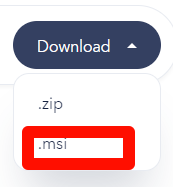
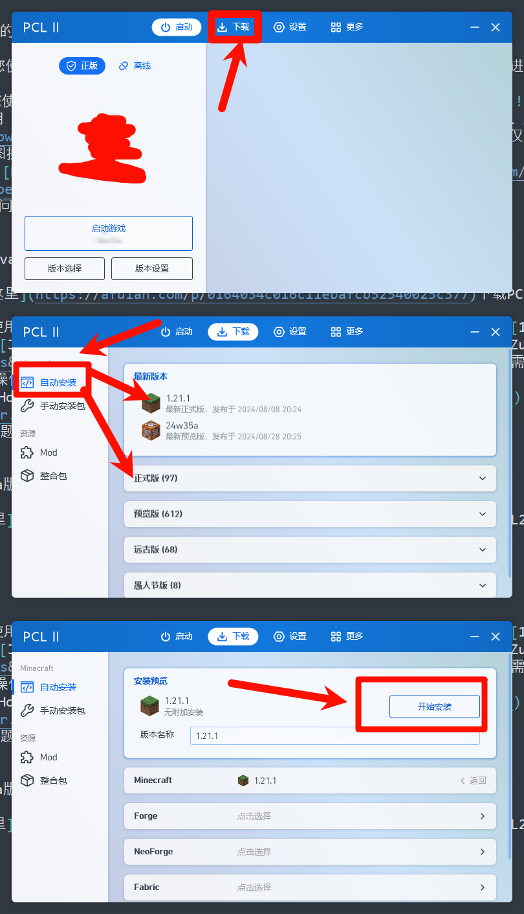
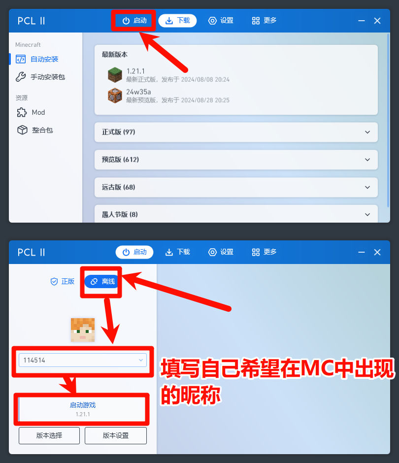
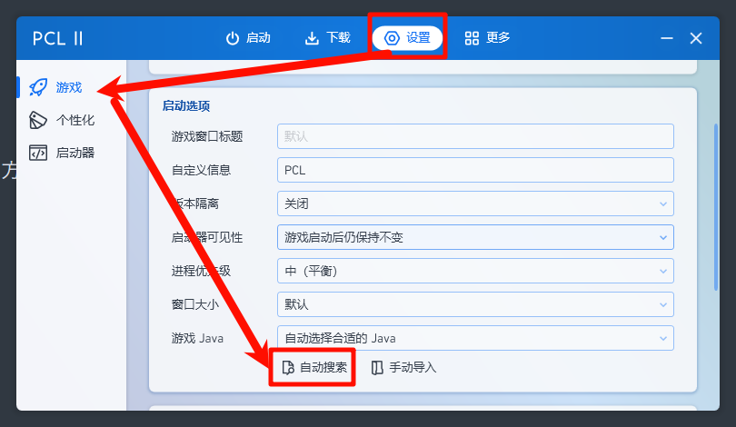

---
# 这是文章的标题
title: 新手上路
# 你可以自定义封面图片
cover: /assets/images/cover1.jpg
# 这是页面的图标
icon: file
# 这是侧边栏的顺序
order: 1
# 设置作者
author: Natsumi
# 设置写作时间
date: 2024-08-28
# 一个页面可以有多个分类
category:
  - 使用指南
# 一个页面可以有多个标签
tag:
  - 快速开始
# 此页面会在文章列表置顶
sticky: true
# 此页面会出现在星标文章中
star: true
# 你可以自定义页脚
# footer: 这是测试显示的页脚
# 你可以自定义版权信息
copyright: Copyright © 2024 BetterMinecraftHelpDocs Project
---
# 简介
在"新手上路"这一篇文章中会教您如何使用"离线模式"进行我的世界Java版本的游玩

# 安装环境

既然是“新手上路”，故本篇文章中将默认您使用的是 Windows 操作系统 !!白嫖!!!
「本wiki所述内容，（仅）建议有基础计算机操作能力。如果你无法理解本wiki中讲解部分内容，推荐Baidu.com或其他学习网站。」

!!所有的安装无脑 next/下一步 即可!! 

- 在游玩 1.12.2 及以下的版本时，我们推荐您使用 [Java8 甲骨文发行版](https://www.java.com/zh-CN/download/)进行游玩。点击 “下载Java” 按钮下载文件并安装即可
- 在游玩 1.13-1.16.5 的版本时，我们推荐您使用 [Java8 龙井JDK](https://dragonwell-jdk.io/#/index)进行游玩。照这样子选择即可
- 在游玩 1.17 及以上版本时，我们推荐您使用 [Java21 龙井JDK](https://dragonwell-jdk.io/#/index) 或 [Java21 Zulu JRE](https://www.azul.com/downloads/?version=java-21-lts&os=windows&architecture=x86-64-bit&package=jre#zulu)进行游玩。龙井的下载仅需将上图的"Dragonwell 8"改为"Dragonwell 21"即可，Zulu的话如下图操作即可 
- 当然，我们也准备了一些不同的JDK供您选择 [Hotspot JDK/JRE](https://mirrors.tuna.tsinghua.edu.cn/Adoptium/)（由清华大学镜像站提供加速下载）、[OpenJ9/Semeru JDK/JRE](https://developer.ibm.com/languages/java/semeru-runtimes/downloads/)（可极大的优化运行内存，但同时也带来了一些问题）!!至于为什么这个JDK有两个名字，那就得问问万恶的IMB了((!!

# 启动器的下载以及游戏的启动
本篇文章中默认为使用离线模式进行我的世界Java版本的游玩，故暂不介绍 Minecraft 官方启动器。

离线模式并非盗版，Mojang Studio允许游戏玩家先体验游戏后进行购买，离线模式是先行体验游戏的一种方式，也是无法联网进行游戏的一种方式。有条件的可以前往 [Microsoft Store](https://www.xbox.com/zh-cn/games/store/minecraft-java-bedrock-edition-for-pc/9NXP44L49SHJ/0010) 或 [Minecraft 官网](https://www.minecraft.net/zh-hans/store/minecraft-java-bedrock-edition-pc) 进行购买

本篇文章使用PCL2启动器作为教学。您可以从[这里](https://afdian.com/p/0164034c016c11ebafcb52540025c377)下载PCL2正式版。

## 第一步：下载游戏

1. 打开PCL2启动器

2. 点击下载

3. 点击自动安装

4. 点击版本选择

5. 点击开始安装

流程图：

## 第二步：启动游戏

1. 点击顶栏的"启动"

2. 点击离线

3. 在头像下的输入框中输入自己想要在游戏中出现的昵称

4. 点击启动游戏，等待启动即可

流程图：

## 常见错误：

### Java 不可用

如果出现JAVA不可用/不存在之类的错误，您可以按以下方式解决

1. 确保您已经安装了"安装环境"中所需要的JAVA

2. 点击 PCL2 的 设置

3. 点击 游戏

4. 往下滑找到 启动选项-->游戏 Java-->点击自动搜索 Java

5. 再次尝试启动游戏

流程图：

