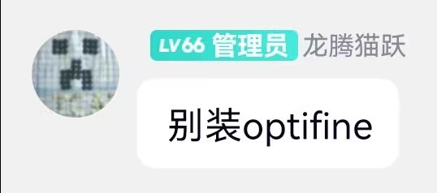

---
# 这是文章的标题
title: （未完成）模组游玩快速入门
# 你可以自定义封面图片
cover: /assets/images/cover1.jpg
# 这是页面的图标
icon: file
# 这是侧边栏的顺序
order: 2
# 设置作者
author: Linear0us
# 设置写作时间
date: 2024-09-21
# 一个页面可以有多个分类
category:
  - 使用指南
# 一个页面可以有多个标签
tag:
  - 快速开始
# 此页面会在文章列表置顶
sticky: false
# 此页面会出现在星标文章中
star: false
# 你可以自定义页脚
# footer: 这是测试显示的页脚
# 你可以自定义版权信息
copyright: Copyright © 2024 BetterMinecraftHelpDocs Project
---

# 模组游玩快速入门

本文会引导您快速开始模组游玩

> [!caution]
> 模组并非Mojang Studio开发制作的内容，模组及模组加载器是由玩家群体自行开发的   
> 游玩前请认真阅读 [Minecraft 最终用户许可协议 (“EULA”)](https://www.minecraft.net/zh-hans/eula) 及模组加载器/模组的使用条款    
> 使用模组被视为对游戏的修改，有时被视为作弊    
> 请确保使用模组时符合正确的使用情景

> [!warning]
> 在开始模组游玩前，请确保开启了版本隔离并隔离所有版本（或隔离可安装mod的版本）  
> 如果您之前在未开启版本隔离的情况下有`创建存档`、`添加Mod`、`添加资源包`的操作，请手动转移对应文件

## 安装模组加载器

通常在Minecraft中，模组是通过模组加载器对游戏进行修改的。   
常见的模组加载器（2024年9月）：
- [Forge](https://files.minecraftforge.net/net/minecraftforge/forge/) (1.1-1.21.1)
- [NeoForge](https://neoforged.net/) (1.20.1-1.21.1)
- [Fabric](https://fabricmc.net/) (1.14-1.21.1)
- [Quilt](https://quiltmc.org/en/) (1.14-1.21) （**仍处于Beta阶段**）
- [LiteLoader](http://www.liteloader.com/) (1.3.2-1.12.2) （停止维护）

PCL2、HMCL均支持在安装客户端时自动安装模组加载器，具体情况支持情况如下表    

> [!tip]
> 模组加载器互不兼容，一个游戏仅能安装一个模组加载器

|模组加载器|PCL2|HMCL|BakaXL|MulitiMC
|---|---|---|---|---|
|Forge|✅|✅|✅|✅|
|NeoForge|✅|✅|✅|✅|
|Fabric(Fabric API)|✅|✅|✅|✅|
|Quilt(QSL/QFAPI)|❌|✅|❔|❔|
|LiteLoader|✅|✅|✅|✅|

> [!important]
> 通常在自动安装界面，还有一个叫做OptFine的东西   
> [OptFine](https://optifine.net/home)（高清修复）对游戏增加了光影支持，动态光源，更精细的纹理包支持（1.5.2+）等功能    
> 但由于OptFine对原版jar的破坏性修改导致1.12.2以上的版本兼容性并不好，并且可能导致各种各样的奇怪问题（详见[MC百科](https://www.mcmod.cn/class/36.html)）  
> 故我们建议，在1.13及以上版本且**安装模组加载器的情况下** 使用   
> [Embeddium](https://www.curseforge.com/minecraft/mc-mods/embeddium)+ 
> [Oculus](https://www.curseforge.com/minecraft/mc-mods/oculus)(Forge/NeoForge)   
> [Sodium](https://www.curseforge.com/minecraft/mc-mods/sodium)+
> [Iris Shaders](https://www.irisshaders.dev)(Fabric/Quilt)   
> 代替OptFine的功能   
> !!HMCL为了避免这种问题直接将OptFine和加载器设为了不兼容!!   
> !!PCL2 xD群著名群员Wudust曾说过：“由OptFine导致的任何问题都不予解决”!!  
> !!所以当你的游戏安装模组后崩溃，首先把OptFine干掉!!
> 

### PCL2

   
这是PCL2的自动安装界面，在右侧选择你要安装的游戏版本，此处我们以1.20.1为例

选择游戏版本，进入安装详情界面    

在此处选择要安装的模组加载器，建议直接选择最新版，然后点击开始安装

### HMCL

## 安装模组

!!这应该是个人都会所以待会再写!!

