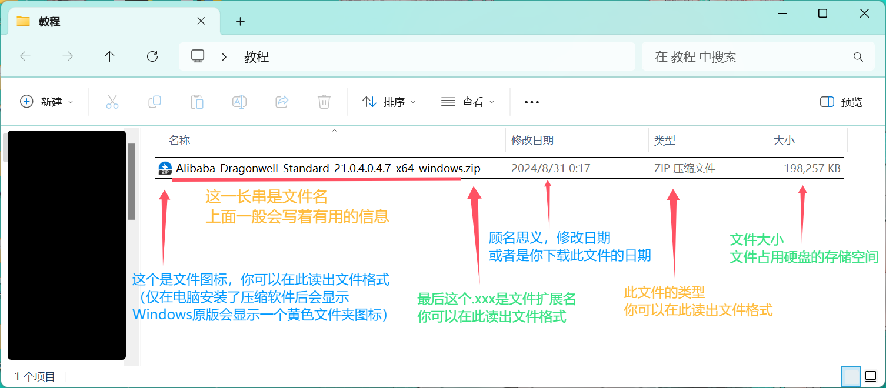

---
# 这是文章的标题
title: 1.0.1 文件的解压操作
# 你可以自定义封面图片
cover: /assets/images/cover1.jpg
# 这是页面的图标
icon: file
# 这是侧边栏的顺序
order: 2
# 设置作者
author: Verdigris
# 设置写作时间
date: 2024-08-31
# 一个页面可以有多个分类
category:
  - 新手上路
  - 使用指南
# 一个页面可以有多个标签
tag:
  - Windows基础
# 此页面会在文章列表置顶
sticky: true
# 此页面会出现在星标文章中
star: true
# 你可以自定义页脚
# footer: 这是测试显示的页脚
# 你可以自定义版权信息
copyright: Copyright © 2024 BetterMinecraftHelpDocs Project
---
## **前言**

- 在进行游戏的准备操作时，不免会遇到文件的解压操作
- 尤其是在刚接触PC个人电脑的新人来说，由于Java版Minecraft上手难度较高，需要自行配置相关工具
- 在进行***Java环境的下载时*** 或者 ***得到大佬的帮助后***，拿到的可能是一个被打包好的压缩文件
- 接下来本篇文档将详细说明***压缩文件在Windows11操作系统***的解压操作

## **识别压缩文件格式**

- 正确的解压一个压缩文件，需要确认此压缩文件的格式，动用正确的解压工具进行解压

!!不过现代压缩软件应该几乎能解压所有主流格式了罢(!!

- 接下来本文档以[Java21 龙井JDK x64标准版](https://dragonwell.oss-cn-shanghai.aliyuncs.com/21.0.4.0.4%2B7-test-dragonwell_standard/Alibaba_Dragonwell_Standard_21.0.4.0.4.7_x64_windows.zip)的压缩文件进行后续教学

- 先来看一下Windows11资源管理器显示文件的方式

::: tip 【关于】为什么没有.xxx显示扩展名？
在Windows11中，你可以按工具栏的查看-显示-勾选文件扩展名来显示文件的扩展名

:::

- 由此可见，此文件是一个[zip]格式的压缩文件

## **文件的解压**

- Windows资源管理器可以在没有第三方解压软件的时候解压zip格式的文件

- 您可以选择文件后直接右击鼠标，在菜单栏中选择**全部解压缩**

- 选择合适的**路径**，解压后的文件会在您选择的路径出现

- 未完待续...
