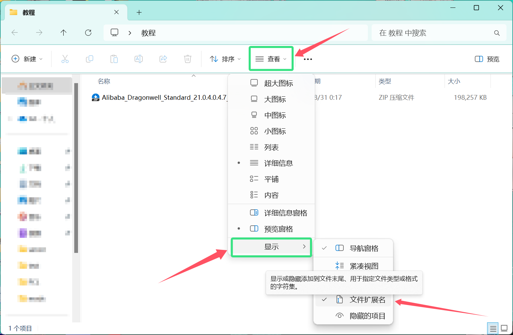
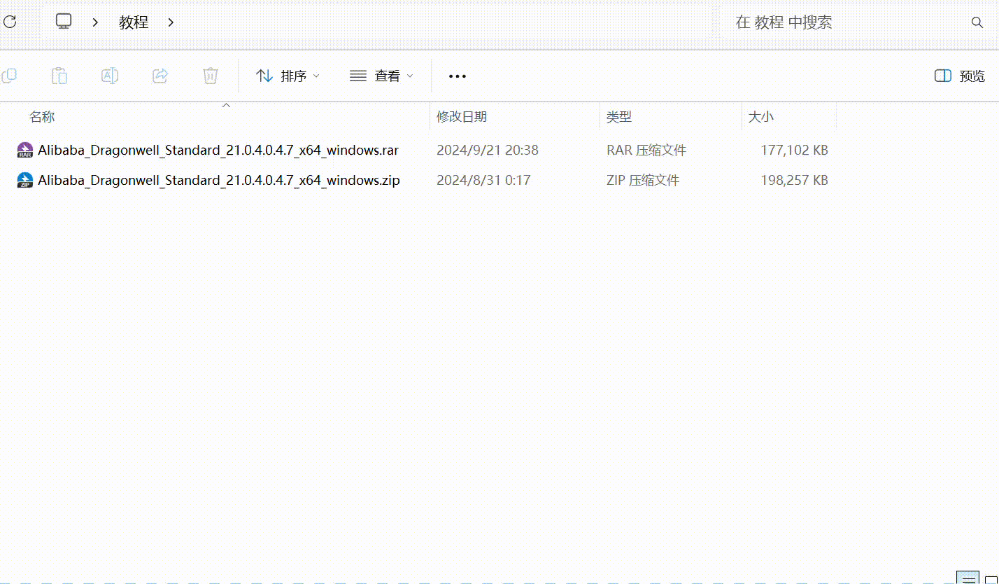

---
# 这是文章的标题
title: 1.0.1 文件的解压操作
# 你可以自定义封面图片
cover: /assets/images/cover1.jpg
# 这是页面的图标
icon: file
# 这是侧边栏的顺序
order: 2
# 设置作者
author: Verdigris
# 设置写作时间
date: 2024-08-31
# 一个页面可以有多个分类
category:
  - 新手上路
  - 使用指南
# 一个页面可以有多个标签
tag:
  - Windows基础
# 此页面会在文章列表置顶
sticky: true
# 此页面会出现在星标文章中
star: true
# 你可以自定义页脚
# footer: 这是测试显示的页脚
# 你可以自定义版权信息
copyright: Copyright © 2024 BetterMinecraftHelpDocs Project
---
## **前言**

- 在进行游戏的准备操作时，不免会遇到文件的解压操作
- 尤其是在刚接触PC个人电脑的新人来说，由于Java版Minecraft上手难度较高，需要自行配置相关工具
- 在进行***Java环境的下载时*** 或者 ***得到大佬的帮助后***，拿到的可能是一个被打包好的压缩文件
- 接下来本篇文档将详细说明***压缩文件在Windows11操作系统***的解压操作

## **识别压缩文件格式**

- 正确的解压一个压缩文件，需要确认此压缩文件的格式，动用正确的解压工具进行解压

!!不过现代压缩软件应该几乎能解压所有主流格式了罢(!!

- 接下来本文档以[Java 龙井JDK](https://dragonwell-jdk.io)的压缩文件进行后续教学
- 先来看一下Windows11资源管理器显示文件的方式

::: tip 【关于】为什么没有.xxx显示扩展名？
在Windows11中，你可以按工具栏的查看-显示-勾选文件扩展名来显示文件的扩展名

:::

- 由此可见，此文件是一个[zip]格式的压缩文件

## **文件的解压**

### Windows资源管理器

- Windows资源管理器可以在没有第三方解压软件的时候解压部分格式的文件
- 您可以选择文件后直接右击鼠标，在菜单栏中选择**全部解压缩**
- 选择合适的**路径**，解压后的文件会在您选择的路径出现

- 如果您发现您无法解压压缩文件，请参照下一篇第三方解压器

### 第三方的解压器

- Windows资源管理器可能无法解压所有的压缩文件格式，或者您的系统版本相对落后，或者经过了精简，可能无法使用Windows资源管理器进行解压操作，这时候可以使用第三方解压软件
- 下面将使用WinRAR举例，完成第三方解压器解压文件操作的教程
- 您可以在此处蓝标文字下载[WinRAR](https://www.winrar.com.cn)

#### 方式一（如果WinRAR操作注册进了右键菜单）

***WinRAR操作注册进了右键菜单的表现方式为，对文件右击的菜单有WinRAR选项***

- 您可以对着文件进行右击，选择**WinRAR**，选择 解压到**xxx文件路径**进行解压操作

::: warning
不建议使用**解压到当前文件夹**选项进行解压

此操作可能会导致压缩包内的文件爆炸性的散开到当前文件夹而没有创建一个文件夹

!!如果许多文件散开到了桌面上，就像是打碎的花瓶难以清理干净，会导致您立刻红温，严重影响您的健康！！(!!
:::

#### 方式二（如果进行了文件格式关联）

***WinRAR进行了文件格式关联的表现方式为，压缩文件显示的图标为WinRAR定义的图标***

- 您可以对着文件直接双击打开，WinRAR的图形界面将会启动

- 选择**解压到**指令

- 你也可以直接快速拖拽进创建好的文件夹中

