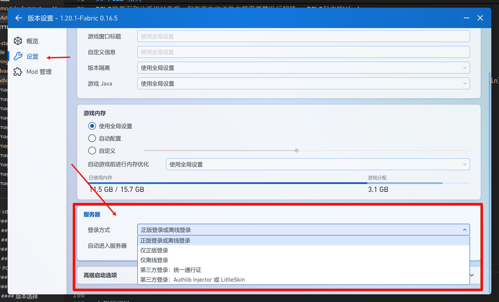
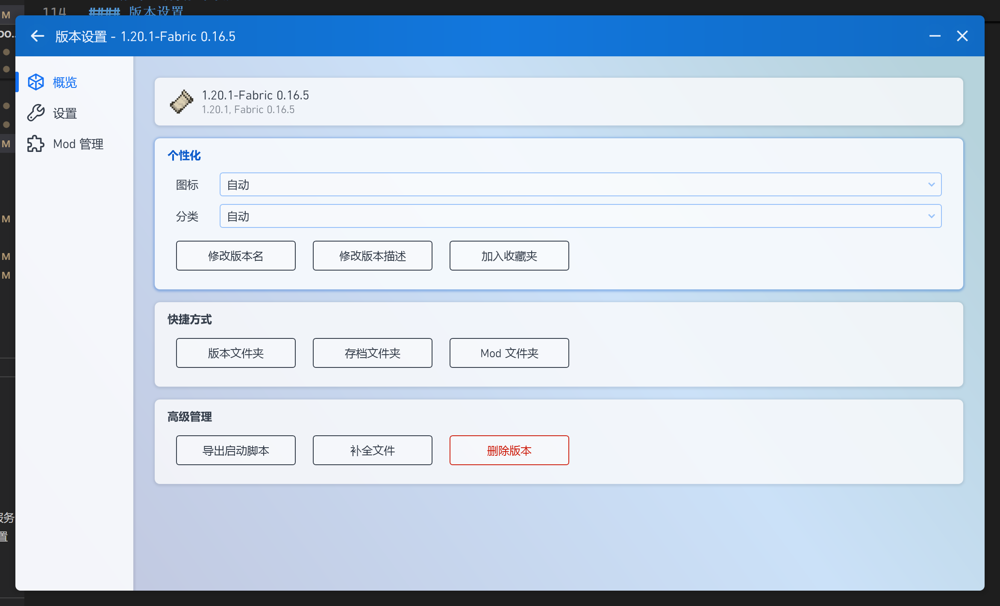
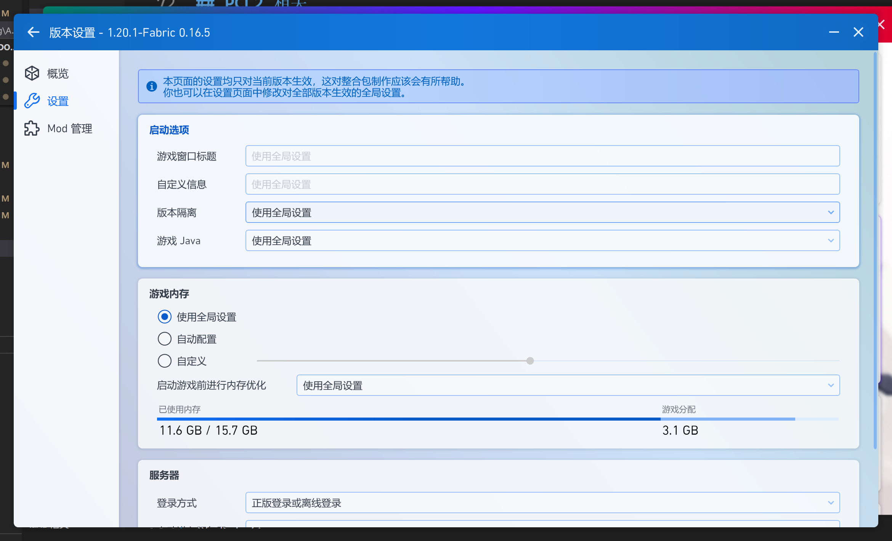

---
# 这是文章的标题
title: 启动器的进阶使用
# 你可以自定义封面图片
cover: /assets/images/cover1.jpg
# 这是页面的图标
icon: file
# 这是侧边栏的顺序
order: 3
# 设置作者
author: LIPiston/Linear0us
# 设置写作时间
date: 2024-08-30
# 一个页面可以有多个分类
category:
  - 使用指南
# 一个页面可以有多个标签
tag:
  - 进阶
# 此页面会在文章列表置顶
sticky: true
# 此页面会出现在星标文章中
star: true
# 你可以自定义页脚
# footer: 这是测试显示的页脚
# 你可以自定义版权信息
copyright: Copyright © 2024 BetterMinecraftHelpDocs Project
---

在本文你将深入了解 Minecraft 启动器的较为进阶选项

## HMCL 相关

HMCL 具有较高的可玩性

### 版本列表

这是 HMCL 的版本管理界面  
左侧分为上下两部分`游戏目录`和`“版本列表工具”`
右侧则是当前目录下的游戏版本

在右侧你可以打开每个版本的单独设置，也可以快速对游戏进行测试（点击 小火箭 即可启动游戏的同时打开日志面板以查看游戏运行数据）  

#### 游戏目录

你可以自行添加任何一个文件夹作为你存放 Minecraft 游戏文件  
!!谁想用系统盘装 Minecraft 呢不是!!  
_请保证你的文件夹具有读写权限_

#### 版本列表工具

`安装新游戏版本`详见[新手上路](/get-start/)  
`安装整合包`可以对指定格式的整合包进行安装，也可以通过链接去安装，这里推荐使用“从 Curseforge/Modrinth 下载安装整合包”   
> [!info]   
> Curseforge/Modrinth上面有相当多他人制作的 mod 整合包、优化游戏帧数整合包等等

### 全局游戏设置

在这你可以使用`内存分配`，`版本隔离`，`Java选择`等功能  

!!各选项详细往后再写!!
  
__注意：这里的设置会默认作用于所有未开启`游戏特定设置`的版本__

#### 游戏管理

在此处可以对游戏的`模组/mods`，`世界/worlds`，`模组加载器/modLoader`，`游戏各文件夹`进行管理

## PCL2相关

PCL2的界面和动画相对美观，但高度自定义的主题需要赞助后解锁。 PCL2仅支持Windows

> [!tip]
> PCL2内置的帮助文档 `更多->帮助`
> 

### 第三方登录验证服务器

PCL2支持以第三方登录验证服务器登录 如[统一通行证](https://login.mc-user.com:233/account/login)，[LittleSkin](https://littleskin.cn/)，自建的Yggdrasil API等

在`启动->版本设置->设置->服务器`中选择要使用的登录方式，并按照说明填入配置项  

> [!tip]
> 部分皮肤站会提供快捷配置按钮（如图），按标注操作即可   
> 
  
### 版本选择/版本设置

#### 版本选择

这是PCL2的版本选择界面。  
左侧栏可以：
- 选择`\.minecraft`文件夹  
  - 官方启动器文件夹默认为`C:\Users\Username\AppData\Roaming\.minecraft`  
  - 也可手动指定文件夹
- 导入整合包
  
> [!note]
> 整合包可从CurseForge、Modrinth等网站下载，后缀名一般为`.rar` `.zip` `.mrpack`  
> !!也可以使用PCL2内置下载 虽然可以自动安装!!

右侧栏可以：
- 选择版本  
将鼠标悬停在对应版本后其右侧会浮现三个按钮：收藏、删除、设置  
  
点击设置将进入对应版本的版本设置界面  

#### 版本设置

你可以在此处调整对于`单个游戏版本`的设置，全局设置位于`设置->游戏`  

概览页  
此处内容均为字面意思

设置页  
> [!warning]
> 此处设置作用与全局设置相同，但仅作用于单一版本 默认全部使用全局设置   

启动设置:   

此处可以调整游戏启动时的各项选项，将鼠标悬浮在对应配置项上会弹出详细内容卡片   
- **版本隔离**：
  强烈建议在**全局设置**中开启此选项并设置为`隔离所有版本`，此选项会隔离所有版本的存档和模组，有效防止多版本串模组/存档/资源包

- 游戏内存：
  此处可以调整游戏启动时内存的分配量或自动分配      
  建议在**全局设置**中改为自动分配内存  

> [!caution]
> PCL2的自动分配内存在目前版本(Release2.8.6/Snapshot2.8.6)中存在问题    
> 在游戏设置中设置的自动分配内存和全局设置中的自动分配内存在同一状态下分配内存不一    
> 详见[Github Issue](https://github.com/Hex-Dragon/PCL2/issues/4752)  
> 将在下一版本修复   

- 内存优化：
  如果使用的是机械硬盘，不建议开启  
  如果需要使用，建议在**全局设置**中开启  

- 高级启动设置：在不知晓对应配置的正确填写方式前不应更改    
  善用左侧栏的`重置本页配置`功能

还可以在**全局设置**中调整`启动器可见性` `进程优先级`两项  

## BakaXL 相关

## MulitiMC 相关
